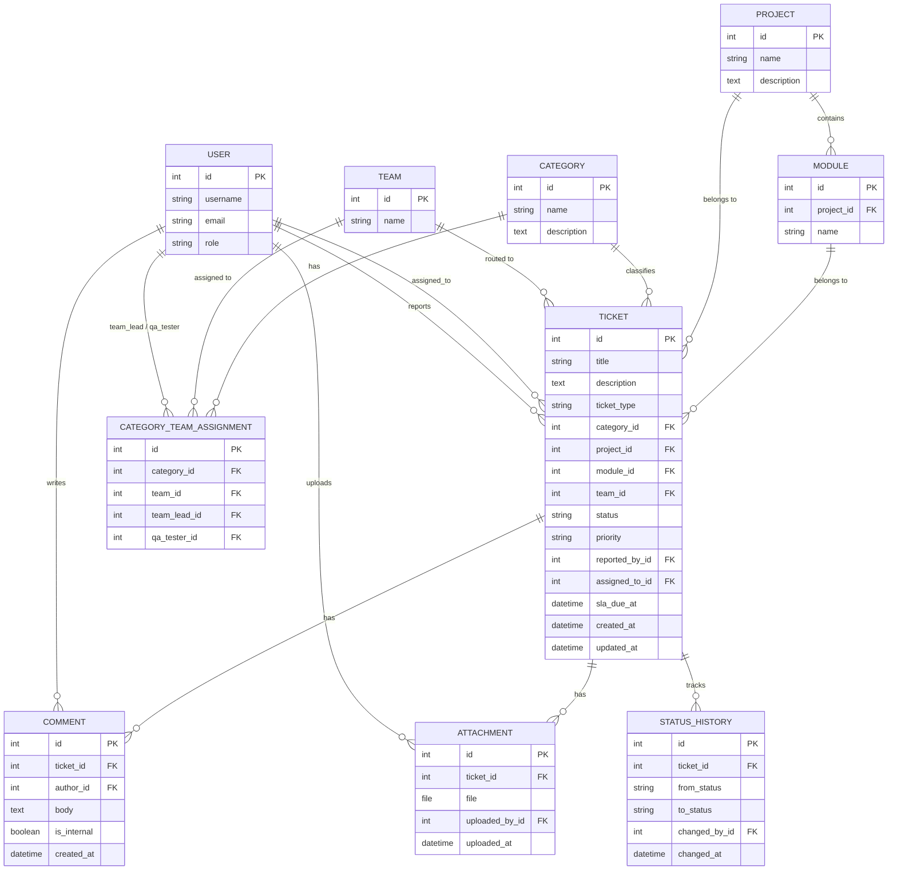

# Entity Relationship Diagram (ERD)

## Diagram

## Entity тайлбар

### User
Django-ийн стандарт `User` эсвэл `AbstractUser`-аас өргөтгөсөн custom модель. Group-оор эрх ялгах (Admin / PM-TeamLead / QA / Developer).

### Team
Хөгжүүлэлтийн баг. Category бүр нэг буюу хэд хэдэн Team-тэй холбогдож болно (routing-д ашиглагдана).

### Category
Ticket-ийн ангилал (жишээ: "Backend API", "UI/UX", "Database"). Category бүрт Team Lead болон QA Tester тохируулагдана.

### CategoryTeamAssignment
Category ↔ Team-ийн холбоос хүснэгт. `team_lead`, `qa_tester` талбарууд нь тухайн category-д хариуцлагатай хүмүүсийг заана. **Ticket auto-routing** энэ хүснэгтээс уншиж, category-д тохирох team-ийг ticket дээр автоматаар онооно.

### Project / Module
Ticket аль төсөл, аль модультай холбоотойг заана. Module нь Project-ийн дэд түвшин.

### Ticket
Системийн гол entity. `ticket_type` (bug/task/change_request), `status` (workflow дагуу), `priority` талбартай.

**SLA (Service Level Agreement):** Ticket үүсэх мөчид `priority`-с хамаарсан хариу үйлдэл хийх дээд хугацаа (`sla_due_at`) автоматаар тооцоологдож бичигдэнэ (тохиргоо: `settings.SLA_HOURS_BY_PRIORITY`):

| Priority | SLA хугацаа |
|---|---|
| CRITICAL | 4 цаг |
| HIGH | 1 өдөр (24 цаг) |
| MEDIUM | 3 өдөр (72 цаг) |
| LOW | 7 өдөр (168 цаг) |

`Ticket.is_overdue` property нь `sla_due_at`-г одоогийн цагтай харьцуулж, ticket хугацаандаа шийдэгдээгүй эсэхийг тодорхойлно (CLOSED/REJECTED төлөвт байгаа ticket-д хамаарахгүй).

### Comment / Attachment
Ticket дээрх харилцан яриа, хавсаргасан файлууд.

**Internal note vs Public reply:** Comment дээр `is_internal` boolean талбар байгаа бөгөөд `True` бол зөвхөн дотоод багийн гишүүд (PM/QA/Developer/Admin) харах зориулалттай тэмдэглэл гэдгийг илэрхийлнэ (Zendesk/Freshdesk-ийн "Internal note" загвартай адилхан). Одоогийн хувилбарт энэ талбар зөвхөн **UI дээр тусгайлан тэмдэглэгдэж харагдана** (шар өнгөөр тодруулсан, 🔒 badge-тай) — ирээдүйд гадаад (customer-facing) портал нэмэгдвэл харагдах эрхийг хязгаарлахад ашиглана.

### StatusHistory
Ticket-ийн status өөрчлөгдөх бүрт бичигдэх audit trail — хэн, хэзээ, ямар төлөвөөс ямар төлөвт шилжүүлснийг хадгална.

## Тодруулга, шийдвэрлэх шаардлагатай асуултууд
- `User.role` талбарыг Django Group-оор бүрэн орлуулах уу, эсвэл нэмэлт `Profile.role` талбар хэрэгтэй юу?
- Нэг Category хэд хэдэн Team-тэй байж болох уу (олон нийтийн routing), эсвэл 1:1 харьцаа хангалттай юу?
- Attachment-ийн файлын хэмжээ/төрлийн хязгаарлалт хэрэгтэй юу (жишээ: зөвхөн зураг, max 10MB)?
