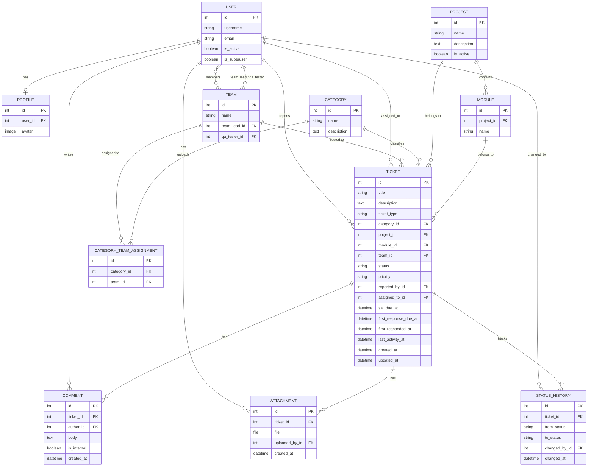

# Entity Relationship Diagram (ERD)

## Diagram

## Entity тайлбар

### User
Django-ийн стандарт `User` модель. Эрхийг `role` талбараар биш, Django **Group**-оор ялгана (Admin / Project Manager / QA Tester / Developer). `is_active=False` бол нэвтрэх эрхгүй, ticket оноогдохгүй, харин түүх нь хадгалагдана (ticket-тэй хэрэглэгчийг устгах оронд идэвхгүй болгоно).

### Profile
User-тэй 1:1 холбоотой нэмэлт мэдээлэл — одоогоор зөвхөн профайлын зураг (`avatar`, 256×256 болгон тайрч хадгална).

### Team
Хөгжүүлэлтийн баг. `members` (M2M → User, Developer group), `team_lead` (ямар ч идэвхтэй хэрэглэгч), `qa_tester` (QA group) талбартай. Team Lead нь өөрийн багийн ticket дээр PM-ийн эрхтэй (оноох, хариуцагч/чухлын зэрэг солих, татгалзах, дахин нээх) болон багийн dashboard харна. Category бүр нэг буюу хэд хэдэн Team-тэй холбогдож болно (routing-д ашиглагдана).

### Category
Ticket-ийн ангилал (жишээ: "Backend API", "UI/UX", "Database"). Нэг Category **олон Team**-тэй холбогдож болно (CategoryTeamAssignment-аар).

### CategoryTeamAssignment
Category ↔ Team-ийн холбоос хүснэгт (`unique(category, team)`) — нэг Category олон Team-тэй байж болно. **Ticket auto-routing:** ticket үүсэхэд тухайн Category-ийн багуудаас хамгийн цөөн идэвхтэй ticket-тэй багийг сонгож `ticket.team`-д автоматаар онооно. Team Lead / QA Tester нь Team дээр тохируулагдана.

### Project / Module
Ticket аль төсөл, аль модультай холбоотойг заана. Module нь Project-ийн дэд түвшин (нэг төсөлд модулийн нэр давхцахгүй). `Project.is_active=False` бол шинэ ticket үүсгэх сонголтод гарахгүй. Ticket-тэй төслийг устгах боломжгүй (`PROTECT`) — оронд нь идэвхгүй болгоно. Module устгавал холбогдох ticket-ийн `module` хоосон болно (`SET_NULL`).

### Ticket
Системийн гол entity. `ticket_type` (bug/task/change_request), `status` (workflow дагуу), `priority` талбартай.

**SLA (Service Level Agreement):** Ticket үүсэх мөчид `priority`-с хамаарсан хариу үйлдэл хийх дээд хугацаа (`sla_due_at`) автоматаар тооцоологдож бичигдэнэ (тохиргоо: `settings.SLA_HOURS_BY_PRIORITY`):

| Priority | SLA хугацаа |
|---|---|
| CRITICAL | 4 цаг |
| HIGH | 1 өдөр (24 цаг) |
| MEDIUM | 3 өдөр (72 цаг) |
| LOW | 7 өдөр (168 цаг) |

SLA нь Jira Service Management-ийн адил 2 metric-тэй: **Time to First Response** (`first_response_due_at` / `first_responded_at`, `settings.SLA_FIRST_RESPONSE_HOURS_BY_PRIORITY`) ба **Time to Resolution** (`sla_due_at`). Priority өөрчлөгдвөл хоёулаа ticket үүссэн мөчөөс дахин тооцоологдоно. `last_activity_at` нь идэвхгүй ticket-ийн сануулгад (`check_stale_tickets`) ашиглагдана.

`Ticket.is_overdue` property нь `sla_due_at`-г одоогийн цагтай харьцуулж, ticket хугацаандаа шийдэгдээгүй эсэхийг тодорхойлно (CLOSED/REJECTED төлөвт байгаа ticket-д хамаарахгүй).

### Comment / Attachment
Ticket дээрх харилцан яриа, хавсаргасан файлууд.

**Internal note vs Public reply:** Comment дээр `is_internal` boolean талбар байгаа бөгөөд `True` бол зөвхөн дотоод багийн гишүүд (PM/QA/Developer/Admin) харах зориулалттай тэмдэглэл гэдгийг илэрхийлнэ (Zendesk/Freshdesk-ийн "Internal note" загвартай адилхан). Дотоод тэмдэглэлийг зөвхөн PM/Admin, ticket-ийн хариуцагч болон тухайн багийн гишүүн / Team Lead / QA Tester харж, бичнэ. Бусад хэрэглэгч (жишээ нь багт хамааралгүй мэдээлэгч) харахгүй, "Internal note" сонголт ч гарахгүй. UI дээр шар өнгө, 🔒 badge-аар ялгагдана. Гараар бичих сэтгэгдэл хоосон байж болохгүй; status шилжилтийн тайлбар л хоосон байж болно.

**Хавсралт файл** нь нийтэд нээлттэй `media/`-д биш `private_media/`-д хадгалагдаж, зөвхөн нэвтэрсэн хэрэглэгч `/attachments/<id>/` view-ээр татна (зураг, pdf, txt хөтөч дотор нээгдэнэ; бусад төрөл татагдана).

### StatusHistory
Ticket-ийн status өөрчлөгдөх бүрт бичигдэх audit trail — хэн, хэзээ, ямар төлөвөөс ямар төлөвт шилжүүлснийг хадгална.

## Шийдвэрлэгдсэн асуултууд
- **Эрх** — `User.role` талбар нэмэлгүй, Django Group-оор бүрэн орлуулсан.
- **Category ↔ Team** — нэг Category олон Team-тэй байж болно; ачааллаар routing хийнэ.
- **Attachment** — нэг файл хамгийн ихдээ 10MB, зөвшөөрөгдсөн өргөтгөлүүд `settings.ATTACHMENT_ALLOWED_EXTENSIONS`-д.
