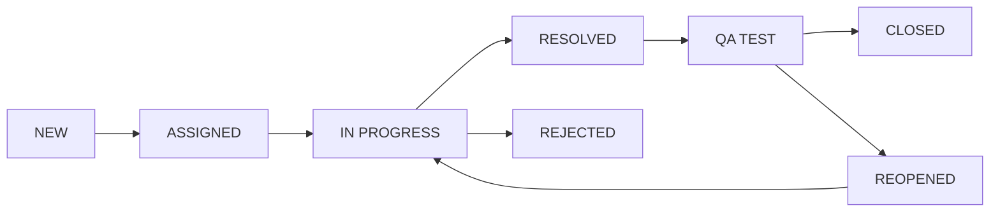

# Ticket Workflow

## Diagram



## Status тодорхойлолт

| Status | Тайлбар |
|---|---|
| `NEW` | Ticket шинээр үүссэн, хараахан хариуцагчгүй |
| `ASSIGNED` | Category-ийн дагуу team рүү чиглэгдэж, хариуцах ажилтан оноогдсон |
| `IN_PROGRESS` | Developer/Agent ажиллаж эхэлсэн |
| `RESOLVED` | Developer шийдвэрлэсэн гэж тэмдэглэсэн |
| `REJECTED` | Ticket хүчингүй/давхардсан/буруу гэж татгалзсан |
| `QA_TEST` | QA шалгаж байгаа |
| `REOPENED` | QA дахин нээсэн (шийдэл хангалтгүй) |
| `CLOSED` | QA баталгаажуулж хаасан |

## Зөвшөөрөгдсөн шилжилтүүд (Allowed Transitions)

| Одоогийн Status | Боломжит дараагийн Status | Хийж болох эрх |
|---|---|---|
| NEW | ASSIGNED | PM/Team Lead |
| ASSIGNED | IN_PROGRESS | Developer/Agent |
| IN_PROGRESS | RESOLVED | Developer/Agent |
| IN_PROGRESS | REJECTED | Developer/Agent, PM/Team Lead |
| RESOLVED | QA_TEST | Автомат эсвэл QA |
| QA_TEST | CLOSED | QA |
| QA_TEST | REOPENED | QA |
| REOPENED | IN_PROGRESS | Developer/Agent |

> Дээрх хүснэгтэд байхгүй шилжилт (жишээ нь `NEW` → `CLOSED`) программаар хориглогдоно.

## Хэрэгжүүлэлтийн санал (Django)

```python
ALLOWED_TRANSITIONS = {
    "new": ["assigned"],
    "assigned": ["in_progress"],
    "in_progress": ["resolved", "rejected"],
    "resolved": ["qa_test"],
    "qa_test": ["closed", "reopened"],
    "reopened": ["in_progress"],
    "rejected": [],
    "closed": [],
}

def can_transition(current_status: str, new_status: str) -> bool:
    return new_status in ALLOWED_TRANSITIONS.get(current_status, [])
```

Status өөрчлөгдөх бүрд `StatusHistory` бичлэг үүсгэж, `from_status`, `to_status`, `changed_by`, `changed_at`-ийг хадгална.

## Тодруулах шаардлагатай асуултууд
- `RESOLVED` → `QA_TEST` шилжилт автоматаар (signal-аар) болох уу, эсвэл Developer гараар товч дарж шилжүүлэх үү?
- `REJECTED` төлөвөөс дахин нээх боломж хэрэгтэй юу (жишээ: PM буруу шийдвэр гэж үзвэл)?
- Reopen хийхэд QA comment заавал бичих шаардлагатай юу (шалтгаан бүртгэх)?