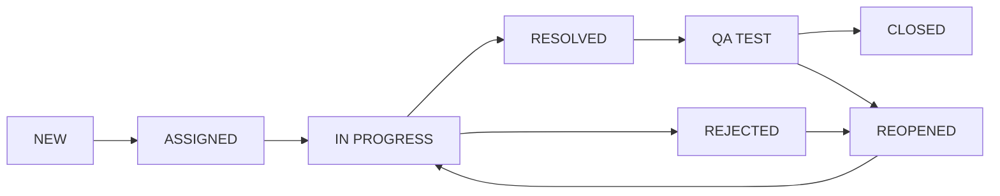

# Ticket Workflow

## Diagram



## Status тодорхойлолт

| Status | Тайлбар |
|---|---|
| `NEW` | Ticket шинээр үүссэн, хараахан хариуцагчгүй |
| `ASSIGNED` | Category-ийн дагуу team рүү чиглэгдэж, хариуцах ажилтан оноогдсон |
| `IN_PROGRESS` | Developer/Agent ажиллаж эхэлсэн |
| `RESOLVED` | Developer шийдвэрлэсэн гэж тэмдэглэсэн |
| `REJECTED` | Ticket хүчингүй/давхардсан/буруу гэж татгалзсан (шаардлагатай бол дахин нээгдэж болно) |
| `QA_TEST` | QA шалгаж байгаа |
| `REOPENED` | QA дахин нээсэн (шийдэл хангалтгүй) |
| `CLOSED` | QA баталгаажуулж хаасан |

## Зөвшөөрөгдсөн шилжилтүүд (Allowed Transitions)

| Одоогийн Status | Боломжит дараагийн Status | Хийж болох эрх |
|---|---|---|
| NEW | ASSIGNED | PM/Team Lead |
| ASSIGNED | IN_PROGRESS | Developer/Agent |
| IN_PROGRESS | RESOLVED | Developer/Agent |
| IN_PROGRESS | REJECTED | Developer/Agent, PM/Team Lead |
| RESOLVED | QA_TEST | Developer/Agent ("QA-д илгээх" товч дарж, гараар) |
| QA_TEST | CLOSED | QA |
| QA_TEST | REOPENED | QA (comment сонголтоор — заавал биш) |
| REOPENED | IN_PROGRESS | Developer/Agent |
| REJECTED | REOPENED | PM/Team Lead |

> Дээрх хүснэгтэд байхгүй шилжилт (жишээ нь `NEW` → `CLOSED`) программаар хориглогдоно.
> `RESOLVED → QA_TEST` шилжилт нь **гар аргаар** хийгдэнэ (Django signal-аар автоматаар шилжихгүй) — Developer "Илгээх QA-д" товч дарж явуулна.

## Хэрэгжүүлэлтийн санал (Django)

```python
ALLOWED_TRANSITIONS = {
    "new": ["assigned"],
    "assigned": ["in_progress"],
    "in_progress": ["resolved", "rejected"],
    "resolved": ["qa_test"],
    "qa_test": ["closed", "reopened"],
    "reopened": ["in_progress"],
    "rejected": ["reopened"],
    "closed": [],
}

def can_transition(current_status: str, new_status: str) -> bool:
    return new_status in ALLOWED_TRANSITIONS.get(current_status, [])
```

Status өөрчлөгдөх бүрд `StatusHistory` бичлэг үүсгэж, `from_status`, `to_status`, `changed_by`, `changed_at`-ийг хадгална.

### Comment заавал эсэх (Reopen дээр)
`QA_TEST → REOPENED` болон `REJECTED → REOPENED` шилжилт хийхэд comment **заавал биш, сонголтоор**. UI дээр comment оруулах талбар харагдана, гэхдээ хоосон орхиод шууд submit хийж болно (`Comment.body` заавал биш `blank=True` байдлаар models дээр тохируулна).

## SLA болон Internal note — workflow-д нөлөөлөхгүй

Дараах боломжууд нь **зөвхөн мэдээллийн шинж чанартай** бөгөөд дээрх `ALLOWED_TRANSITIONS` state machine-д ямар ч байдлаар нөлөөлөхгүй, шинэ status нэмэгдээгүй:

- **SLA due date (`sla_due_at`)** — Ticket үүсэх мөчид priority-с хамаарч автоматаар тооцоологдоно (`settings.SLA_HOURS_BY_PRIORITY`: CRITICAL=4ц, HIGH=24ц, MEDIUM=72ц, LOW=168ц). `Ticket.is_overdue` нь зөвхөн UI дээр (улаан өнгөөр) анхааруулах зориулалттай — хугацаа хэтэрсэн ч гэсэн ticket-ийг ямар ч status руу шилжүүлэхийг блоклохгүй. CLOSED/REJECTED төлөвт байгаа ticket "хэтэрсэн" гэж тооцогдохгүй.
- **Internal note (`Comment.is_internal`)** — Comment нэмэхэд зэрэгцээ тохируулах checkbox, зөвхөн харагдах байдлыг ялгаж тэмдэглэнэ (UI дээр шар өнгө, 🔒 badge). Аль ч status шилжилтийн эрх/логикт нөлөөлөхгүй; `ticket.transition_to()`-оор автоматаар үүсдэг comment (status шилжилтийн тайлбар) үргэлж `is_internal=False`-аар үүснэ.

## SLA policy + Escalation automation (Jira Service Management загвартай)

Jira Service Management-ийн адил **2 тусдаа SLA metric** ашиглана:

| Metric | Тайлбар | Тохиргоо |
|---|---|---|
| **Time to First Response** | Ticket-д анх удаа хариу өгөх (NEW-аас шилжих, эсвэл мэдээлэгчээс бусад хүн comment бичих) хүртэлх дээд хугацаа | `settings.SLA_FIRST_RESPONSE_HOURS_BY_PRIORITY` |
| **Time to Resolution** | Ticket-ийг бүрэн шийдвэрлэх (CLOSED/REJECTED болгох) хүртэлх дээд хугацаа | `settings.SLA_HOURS_BY_PRIORITY` (өмнөх `sla_due_at`) |

Хоёр metric тус бүрд **2 шатлалт мэдэгдэл** бий (`settings.SLA_WARNING_THRESHOLD = 0.8`):

1. **Анхааруулга (warning)** — хугацааны 80%-д хүрэхэд хариуцагчид (эсвэл байхгүй бол мэдээлэгчид) сануулна.
2. **Escalation (breach)** — хугацаа бүрмөсөн хэтрэхэд Team Lead болон хариуцагчид мэдэгдэнэ.

Давхар мэдэгдэл илгээхээс сэргийлэхийн тулд `Ticket`-д `*_warning_sent_at` / `*_breach_notified_at` талбарууд бичигдэнэ — эдгээр нь аль хэдийн бичигдсэн бол дахин илгээхгүй.

### Ажиллуулах

`apps/tickets/management/commands/check_sla_deadlines.py` command нь идэвхтэй (CLOSED/REJECTED биш) бүх ticket-ийг шалгаж, шаардлагатай мэдэгдлүүдийг илгээнэ. Периодоор (жишээ нь 15 минут тутамд) ажиллуулах ёстой:

- **Docker Compose ашиглаж байгаа бол**: `infra/docker-compose.yml`-ийн `scheduler` service нь энэ command-ыг автоматаар 15 минут тутамд ажиллуулна (Celery/Redis нэвтрүүлэх хүртэлх түр зуурын шийдэл).
- **Локал/serverless орчинд**: cron ашиглана —
  ```
  */15 * * * * cd /path/to/backend && venv/bin/python manage.py check_sla_deadlines
  ```

### Вебээс гар аргаар тестлэх

Cron/scheduler-ыг хүлээлгүйгээр шууд шалгаж үзэхийг хүсвэл: navbar → **Удирдлага** цэс дотор **"SLA шалгалт ажиллуулах"** товч бий (зөвхөн PM/Admin-д харагдана). Дарахад `check_sla_deadlines` command шууд нэг удаа ажиллаж, илгээсэн анхааруулга/escalation-ийн тоог мэдэгдэл (flash message) хэлбэрээр харуулна.

## Automation rule: Идэвхгүй ticket-д давтан сануулга (Zendesk/Jira загвартай)

SLA escalation нь **ганц удаагийн** мэдэгдэл боловч энэ automation нь **давтан** ажиллана — "N цаг хариугүй бол дахин мэдэгдэх" гэсэн энгийн дүрэм:

- `Ticket.last_activity_at` талбар нь status шилжилт, comment, attachment нэмэгдэх бүрд шинэчлэгдэнэ.
- `settings.STALE_TICKET_REMINDER_HOURS` (анхны утга: 48ц) хугацаанд юу ч болоогүй бол хариуцагчид (эсвэл байхгүй бол Team Lead-д) сануулга илгээнэ.
- Идэвх гараагүй л бол **ижил хугацаа тутамд ДАХИН** давтан илгээгдэнэ (`stale_reminder_sent_at`-аар хянагдана); шинэ идэвх гарвал энэ талбар цэвэрлэгдэж, тоолуур дахин эхэлнэ.
- CLOSED/REJECTED ticket хамаарахгүй.

### Ажиллуулах

`apps/tickets/management/commands/check_stale_tickets.py` — `check_sla_deadlines`-тэй адил periodically ажиллуулна (docker-ийн `scheduler` service нь хоёуланг нь дараалан ажиллуулдаг). Navbar → Удирдлага → **"Идэвхгүй ticket шалгах"** товчоор PM/Admin гар аргаар тестэлж болно.

## Reporting dashboard (Zendesk/Jira Service Management загвартай)

Navbar → **Удирдлага → Тайлан** (`/reports/`, зөвхөн PM/Admin) — сонгосон хугацааны (7/30/90 хоног) дараах метрикүүдийг нэг дор харуулна:

| Хэсэг | Тайлбар |
|---|---|
| **Stat tiles** | Шинээр үүссэн, хаагдсан, одоо нээлттэй (snapshot), дундаж шийдвэрлэх хугацаа |
| **SLA compliance meter** | Time to First Response / Time to Resolution — met/breached харьцаагаар тооцоолсон % биелэлт (≥90% ногоон, ≥70% шар, бусад улаан) |
| **Ticket flow chart** | Өдөр тутам үүссэн ба хаагдсан ticket-ийн тоо (line chart, legend, hover tooltip, хүснэгт хэлбэрээр унтраалттай харах боломж) |
| **Priority/Category breakdown** | Тухайн хугацааны ticket-үүдийг задалсан bar chart |
| **Agent performance** | Хэрэглэгч тус бүрийн оноогдсон/идэвхтэй/хаасан тоо, SLA зөрчсөн тоо, дундаж шийдвэрлэх хугацаа |

Тооцооллын логик бүхэлдээ `apps/tickets/reports.py`-д байрлана (SVG координатыг ч Python талд бодож, template-д зөвхөн зурдаг — тестлэхэд хялбар байлгах үүднээс). Хаагдсан огноог тусдаа талбар биш, `StatusHistory`-оос (`to_status=closed`) уншдаг тул шинэ migration шаардахгүй.
